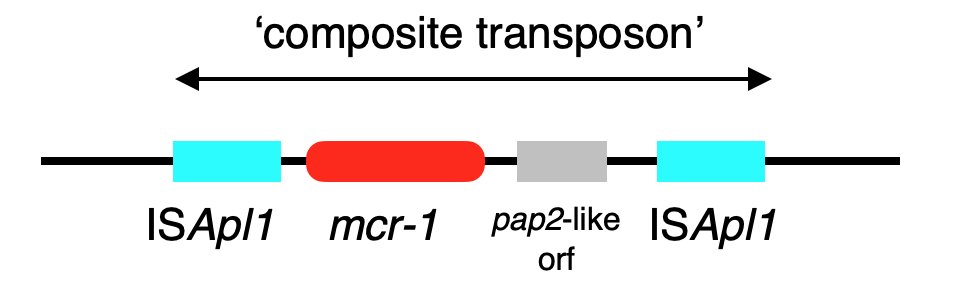

# mcroni

A set of tools for analysing sequence variation around the mcr-1 gene (mobilized colistin resistance).

## Usage

mcroni takes a fasta file and returns some summary information about the context of mcr-1. It also returns the expected local region for aligning the composite transposon (in progress).

```
mcroni --fasta genome1.fa --output output_prefix
```

This will return two output files:

```
output_prefix_table.tsv   : summary information
output_prefix_sequence.fa : extracted sequences
```

You can also pass in a list of fasta files instead with `--filelist`:

```
mcroni --filelist list-of-files.txt --output genomes-output
```

where `list-of-files.txt` has the form

```
path/to/genome1.fa
path/to/genome2.fa
```

## Background

Snesrud et al. (2016) PMID 27620479 proposed a model for the transposition of mcr-1 by ISApl1. A mobile composite transposon structure degraded over time.



Variation within this local genomic context of mcr-1 therefore contains information on its evolutionary history. mcroni doesn't do anything complicated: it's just a convenient wrapper script for assessing this variation automatically (e.g. blasting for ISApl1, finding nearby plasmid replicons).

## Limitations

mcroni assumes there is only one copy of mcr-1 per fasta file. It will give a warning if there are multiple copies. This happens occasionally in real genomes due to the activity of the IS*Apl*1 insertion sequence.

mcroni assumes that contigs are linear. If mcr-1 is near the end of a circularised contig, this could produce incorrect results.

## Name

mcroni (pronounced like [the pasta](https://en.wikipedia.org/wiki/Macaroni)).
